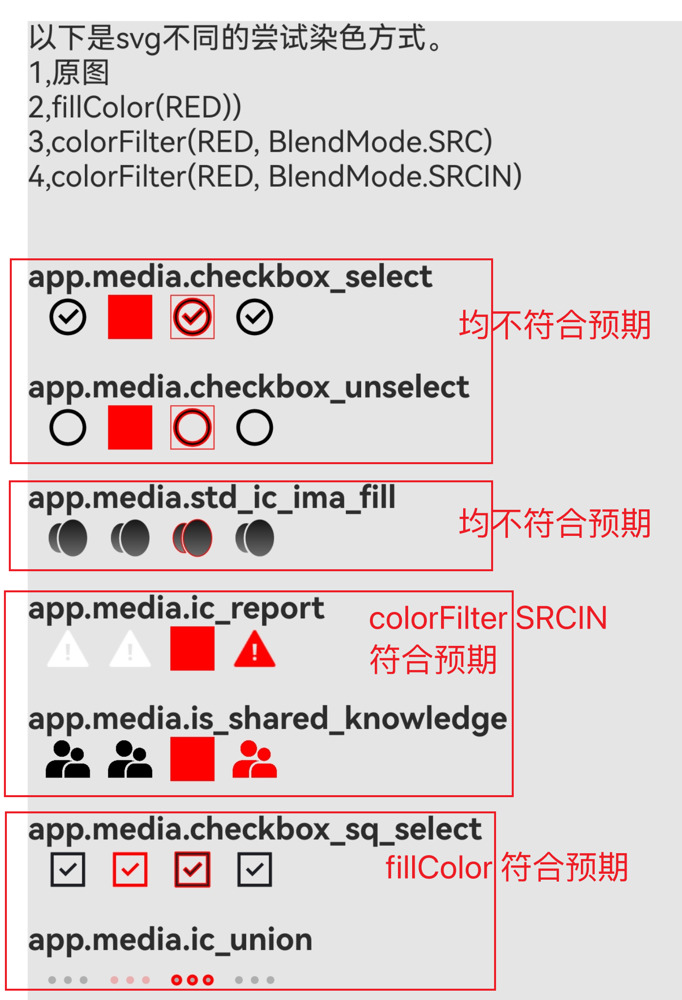

# SVG Image Unexpected Color Demo

我们有对svg图标进行染色的场景（比如在切换主题时）。

我们查阅了官方文档[Image](https://developer.huawei.com/consumer/cn/doc/harmonyos-references/ts-basic-components-image)，[Image示例16设置svg图片的填充颜色](https://developer.huawei.com/consumer/cn/doc/harmonyos-references/ts-basic-components-image#示例16设置svg图片的填充颜色)。发现svg染色结果表现不同。

